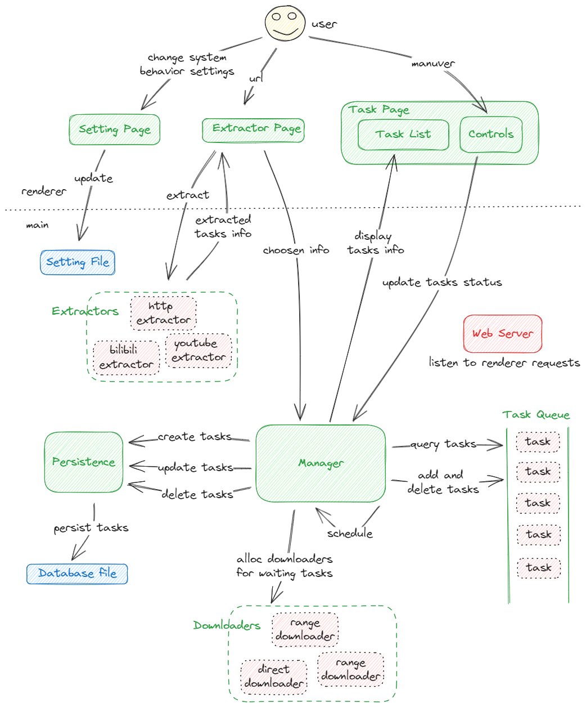

## http-downloader

Duck is a HTTP protocol based downloader, it supports video parsing for some video streaming websites, and also provides a succint GUI using Electron.

<!--  -->

The repository uses React, TypeScript, Tailwind CSS, shadcn UI and Webpack to build frontend pages, uses Go to build the backend http service, and uses Electron to combine them together as a desktop app. 

#### Functionalities

- HTTP downloading, supports task pausing and resuming from break points, supports multitasking.

- GUI visualizes tasks downloading status.

- Downloading videos from some commonly used video streaming websites. 

Some functionalities need ffmpeg in running Environment.

Here is the [todo list](./docs/todo.md).

#### Structure

More [partial structures](./docs/structures.md).

#### Disclaimer

The software is only written and distributed for learning purpose, the author doesn't take responsibility for users' abuse of the software.
